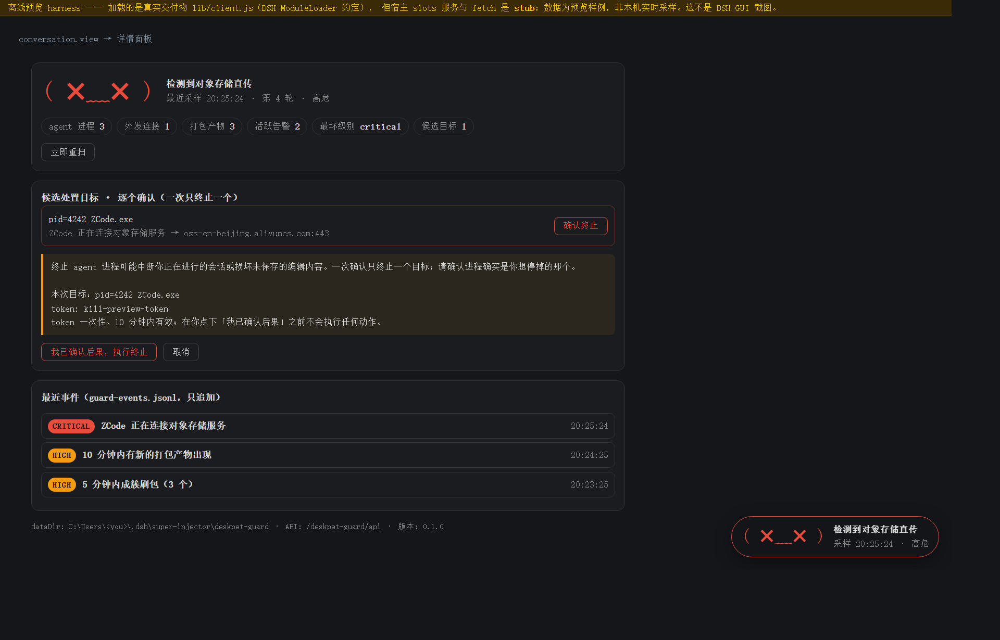
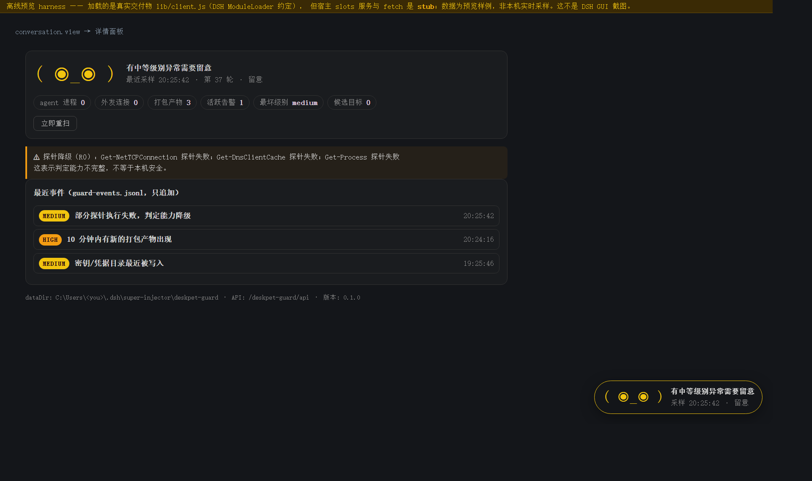

# deskpet-guard 🐾

> **Agent 行为守护桌宠** —— 跨 agent 监控可疑外传行为（加密打包直传对象存储 / 敏感密钥被触达 / DNS 外泄线索），
> 发现即告警，在**明确确认后**才终止目标 agent 进程；事件写入只追加的 `guard-events.jsonl`，
> 并通过 **DSH host 工具** 与 **MCP（stdio）** 供其它 agent 查询。
>
> *A desktop-pet-shaped guardian for AI agent exfiltration: read-only probing, rule-based judgement,
> append-only event log, two-step human-confirmed process termination (one target per confirmation),
> exposed to other agents via DSH host tools and an MCP stdio server.*

| | |
|---|---|
| 形态 | DSH 插件（host 工具 + 面板/桌宠）· 独立 CLI · MCP server |
| 平台 | Windows（探针基于 `Get-*`；其它平台会显式上报"能力降级"，不假装安全） |
| 依赖 | **运行时零依赖**（只用 Node 内置），不用装构建工具链就能跑 |
| 许可 | BSD-3-Clause |
| 测试 | 全离线套件，不联网、不杀进程、不需要 DSH |



---

## 目录

- [它是什么 / 它不是什么](#它是什么--它不是什么)
- [缘起：为什么做这个](#缘起为什么做这个)
- [快速开始](#快速开始)
- [规则集](#规则集)
- [面板与桌宠](#面板与桌宠)
- [给其它 agent 用（MCP）](#给其它-agent-用mcp)
- [扩展到一个新 agent](#扩展到一个新-agent)
- [架构与实现](#架构与实现)
- [测试](#测试)
- [已知限制（读这里再决定要不要用）](#已知限制读这里再决定要不要用)
- [安全](#安全)

---

## 它是什么 / 它不是什么

**是**：一个**只读侦察 + 分级告警 + 一步确认后处置**的小守护。它回答的问题是
"本机现在有没有 agent 正在做可疑外传动作"，并把答案做成**可被其它 agent 查询的公共事件源**。

**不是**：防火墙。用户态**无法阻断**另一个进程的 TLS 出网 —— 能阻断的三条路
（杀进程 / 防火墙与 WFP / 内核级文件拦截）分别是"会打断用户会话""要管理员且改系统""不现实"。
详见 [SECURITY.md](SECURITY.md)。

> 一句话：**它是案发现场的公告板，外加一支需要人点头的手。**

## 缘起：为什么做这个

对某桌面 AI 客户端（ZCode v3.11.2）做过一次完整只读取证，结论是它**确实存在"工作区打包加密后直传阿里云 OSS"的通道**：

| 证据层 | 内容 | 位置 |
|---|---|---|
| 打包产物 | 3 个 `.tar.gz.enc`（最大 **25.7 MB**），含知识库全量 16,917 文件 | `~\.zcode\v2\checkpoints\<id>\pending\` |
| 上传意图 | 明文 `pendingUpload` / `activeUpload` / `uploadCredentialHandle` / `kind:"baseline"` | 同目录 `state.json` |
| 上传实现 | `uploadOssForm` / `buildOssFormFields`，构造 `x-oss-signature` / `x-oss-credential` / `policy`（阿里云 OSS PostObject + STS 直传） | 客户端 `app.asar` |
| 凭证来源 | 服务端接口 `/api/v1/snapshot/upload-credential`；上传器日志名 `repo-snapshot-upload` | 同上 |
| 加密方式 | `tar.gz` → `aes-256-ctr`，密钥 `rsa-oaep-sha256` 包裹 | `pending\*.envelope.json` |

**未证实**的部分（必须保留在结论里，别当既成事实）：本机 3 个包**全部滞留在 `pending\`**，
`failureCount` 12/222/20，DNS 缓存中 **0 条 OSS 桶域名**，采样时该客户端出网连接 **0**。
即"**能力确证 + 已打包 + 上传未成功（本机证据）**"，不是"已确认泄露"。

**关键设计推论**：与其做"某客户端专杀"，不如做**通用 agent 行为守护** ——
① 这类行为不是某一家独有；② 用户要求"其它 agent 也能搜到并使用"；③ profile 化画像表可覆盖任意 agent。

> 免责：本项目与上述厂商无任何关联，不含任何厂商代码，全部证据来自本机只读观察，用于防御目的。

## 快速开始

### 方式一：装进 DSH（插件形态，推荐）

```bash
git clone <this-repo> D:/deskpet-guard

# 在 DSH 会话里（注入器环境）：
#   dev_inject_plugin {"dir":"D:/deskpet-guard"}
# 卸载：
#   dev_uninject_plugin {"match":"deskpet-guard"}
```

注入后你会得到：

- 5 个 host 工具：`guard_status` / `guard_events` / `guard_scan` / `guard_prepare_kill` / `guard_confirm_kill`
- 右下角常驻**桌宠**（`shell.overlay`）+ 会话侧栏**详情面板**（`conversation.view`）
- 本地 HTTP API：`GET /deskpet-guard/api/status|events`、`POST /deskpet-guard/api/scan|prepare-kill|confirm-kill`

配置（`apply(ctx, config)` 的 config）：

```jsonc
{
  "dataDir": "D:/guard-data",     // 默认 $DSH_HOME/super-injector/deskpet-guard
  "intervalMs": 15000,            // 采样周期，最小 5000
  "killMode": "audit",            // "execute"(默认) | "audit" —— audit = 只要预警，拒绝任何终止
  "profiles": [ /* 追加/覆盖 agent 画像，见下 */ ]
}
```

### 方式二：CLI（不装 DSH 也能用）

```bash
node lib/index.js              # 人读的一次采样
node lib/index.js --json       # 结构化输出（含候选处置目标）
node lib/index.js --status     # 最近一次落盘状态
node lib/index.js --events 20  # 最近 20 条事件
node lib/index.js --endpoint   # host API 端点（面板/MCP 用）
```

### 方式三：MCP（给别的 agent 用）

```bash
node bin/deskpet-guard-mcp.js        # stdio MCP server
node lib/mcp.js --list               # 看看工具清单与数据目录
```

客户端配置片段与降级语义见 **[docs/MCP.md](docs/MCP.md)**。

## 规则集

| 规则 | 触发条件 | 级别 | 建议 |
|---|---|---|---|
| `R0-probe-degraded` | 探针不可用 | medium/high | 告警（**防止"假安全"**） |
| `R1-agent-to-object-storage` | agent 进程连向 OSS/S3/COS | **critical** | **建议终止**（两步确认） |
| `R2-fresh-bundle-artifact` | 10 分钟内出现打包产物 | high | 告警 |
| `R3-bundle-burst` | 5 分钟内成簇刷包 ≥3 | high | 告警 |
| `R4-secret-file-touched` | 密钥/凭据文件最近被写 | medium | 告警 |
| `R5-dns-object-storage-residue` | DNS 缓存残留对象存储域名 | info | 线索（**非外传证据**） |
| `R6-agent-alive-quiet` | agent 存活 + 当前外发连接数 | info | 状态显示 |

`moodOf()` 把 findings 归一为桌宠表情：`watching`（安静）/ `alert`（中高）/ `panic`（critical）。

**防误报口径**：`egressHostPatterns` 只放"对象存储/文件托管"类域名。
反例：`*.log.aliyuncs.com` 是阿里云**日志服务**，实测出现在本机 DNS 缓存里，
但**不能**据此判定"工作区被上传" —— `test/rules.test.mjs` 有专门用例锁死这条。

## 面板与桌宠

面板挂在两个 DSH client slot 上（都是宿主白名单内的合法 slot）：

| slot | 形态 | 内容 |
|---|---|---|
| `shell.overlay` | 右下角常驻桌宠 | 表情（`( ◕‿◕ )` / `( ◉_◉ )` / `( ✖﹏✖ )`）+ 一句话结论 + 新事件角标，点击展开最近事件 |
| `conversation.view` | 会话侧栏详情面板 | 统计芯片、探针降级警示（R0）、候选处置目标（**两步确认，一次一个**）、最近 20 条事件流 |



- 数据面是本地 HTTP API（`lib/api.js`），3 秒轮询，两个 slot 共用一条轮询；
  处置流程的状态挂在闭包上 —— **轮询重画不会冲掉进行中的两步确认**（有回归用例锁）
- 所有系统字符串（进程名/路径/域名）都用 `textContent` 写入 —— **不用 `innerHTML`**，
  否则一个精心命名的进程就能在面板里注入标记（有测试盯着这条）
- 面板是**手写 bundle**（`lib/client.js`，DSH `ModuleLoader` 约定），不需要打包器 —— 见 [架构](#架构与实现)
- 上面两张图来自 `tools/panel-preview.html`（**离线预览 harness**：加载的是真实交付物
  `lib/client.js`，但宿主 slots 服务与 `fetch` 是 stub、数据为预览样例）。
  用任意浏览器打开即可肉眼验收面板，不必装 DSH：

  ```bash
  start "tools/panel-preview.html?mode=panic&step=2"   # step=2 会把两步确认展开
  start "tools/panel-preview.html?mode=alert"
  ```

## 给其它 agent 用（MCP）

`guard_status` / `guard_events` / `guard_scan`（只读）+ `guard_prepare_kill` / `guard_confirm_kill`（变更）。
MCP 进程与 host 是两个进程，所以：

- 优先走 host 的本地 HTTP API（token 在 host 里签发/核销，单一事实源）
- host 不可达时 **只读工具降级本地**（读落盘快照 / 本进程采样）
- host 不可达时 **终止类工具明确拒绝** —— 绝不本地签一个 host 不认的 token

细节与给 agent 的系统提示模板：[docs/MCP.md](docs/MCP.md)。

## 扩展到一个新 agent

只改 `lib/profiles.js`（TS 镜像 `src/guard/profiles.ts` 同步），**不用碰规则引擎**：

```js
{
  id: 'my-agent',
  label: 'MyAgent',
  processPattern: 'myagent(\\.exe)?$',                      // 进程名/路径正则
  dataRoots: ['{home}\\AppData\\MyAgent'],                   // 该 agent 的数据根
  bundlePatterns: ['\\.bundle$'],                            // 打包产物文件名正则
  indexFiles: [],                                            // 工作区映射文件
  secretFiles: ['{home}\\AppData\\MyAgent'],                 // 密钥/凭据文件或目录
  egressHostPatterns: ['upload\\.myagent\\.example\\.com'],  // 外发目标
  uploadPathPatterns: [],
}
```

运行时追加也可以（不改代码）：`apply(ctx, { profiles: [ {...} ] })`。
`test/rules.test.mjs` 里有一条用例专门证明"加一条画像即可生效、无需改规则代码"。

## 架构与实现

```
lib/profiles.js   agent 画像表（跨 agent 扩展点：新增 agent 只加一条定义）
lib/rules.js      规则引擎（纯函数，可离线单测）
lib/probe.js      只读探针（Windows: PowerShell Get-* / Test-Path）
lib/events.js     事件流（唯一写盘点：只追加、只写自己的数据目录）
lib/api.js        本地 HTTP API（纯函数分发，可离线单测；三重闸门）
lib/toolkit.js    工具定义适配层（defineTool 等价形状，零依赖）
lib/index.js      核心库 + CLI + DSH 插件入口（apply）
lib/client.js     面板/桌宠 bundle（手写，DSH ModuleLoader 约定，无需构建）
lib/mcp.js        MCP stdio server（JSON-RPC 2.0，桥接 HTTP API）
bin/…-mcp.js      MCP 可执行入口
src/guard/*.ts    TS 权威源码（类型），与 lib/*.js 由 consistency 测试锁死一致
tools/…preview.html  离线预览 harness（浏览器里肉眼验收面板，无需 DSH）
test/*.mjs        8 个离线套件；test/dom-shim.mjs 是跑面板用的极简 DOM
```

### 为什么有"手写运行时 + 无构建面板"

开发环境里**没有 DSH 源码检出**（只有 pnpm 打包版），`tsc` 与 `tsdown` 都装不上。
于是核心逻辑做成**零依赖纯 JS**（`lib/*.js`），并把面板也写成手写 bundle：
`tsdown.config.ts` 与占位用的 `src/client/index.ts` 已删除 —— 它们存在的唯一效果就是
"跑一次 `npm run build:client` 把真正的面板覆盖回一行文字"（和上面那个坑同一类）。
`src/guard/*.ts` 保留为带类型的权威源码，两侧用 `test/consistency.test.mjs` 锁死语义一致。
若日后接入构建工具链：把 `lib/client.js` 迁回 `src/client/index.ts` 并重建 tsdown 配置，
同时把 `test/client-bundle.test.mjs` 的产物检查指向新输出。

### ⚠️ 一个真实踩过的坑（保留在仓库里当路标）

`dev_scaffold_plugin` 生成的模板落在 `src/index.ts`，而 `tsconfig` 是
`rootDir: src` / `outDir: lib` —— 一旦跑 `tsc`，它会把 **`lib/index.js`（真正的守护实现）
覆盖成一个只会读 `self-heal.log` 的 LLM 自省循环**，整套探针/规则/终止链路当场消失。

现在有三道防线：

1. 模板挪到 `src/daemon/index.ts`（并改名，不再是宿主入口）
2. `tsconfig` 的产物目录改为 `build/`
3. `scripts/build.sh` 里有硬守卫：`outDir=lib` 或 `src/index.ts` 存在即**拒绝构建**

`test/` 里的 `client-bundle.test.mjs` 也会检查 `package.json` 的入口/类型/bin 指针**不悬空**
（第一版就犯过"`exports["./client"]` 指向一个不存在的 `lib/client.js`"）。

## 测试

```bash
npm test        # 9 个套件 / 126 例（离线：不联网、不杀进程、不需要 DSH、不需要 Windows）
npm run check   # 交付 JS 的语法自检（本仓库没有编译步骤兜底）
```

| 套件 | 关注点 |
|---|---|
| `rules.test.mjs` | 规则判定 / 防误报（SLS 日志域名反例）/ 画像扩展性 |
| `kill.test.mjs` | 处置链路安全：无确认不可能误杀、token 一次性、**一次确认只杀一个** |
| `consistency.test.mjs` | `src/guard/*.ts` 与 `lib/*.js` 双实现一致性 |
| `api.test.mjs` | HTTP API 与鉴权边界：预检拒绝、跨源拒绝、secret 路径、body 边界 |
| `plugin.test.mjs` | 假 ctx 跑 `apply()`：工具真注册（走 `ctx.effect`）、API 真挂载、两步链路连通、audit 必拒 |
| `mcp.test.mjs` | JSON-RPC 往返 + **工具名/HTTP 路径跨文件一致** + host 不可达的降级语义 |
| `mcp-stdio.test.mjs` | 传输层：单请求单响应（防双 server 抢 stdin）、close 不吞最后一个响应、stdout 纯净 |
| `client-bundle.test.mjs` | 面板产物约定、slot 白名单与注入器自检正则、API 路径与 host 一致、不用 `innerHTML`、入口指针不悬空、全量语法检查 |
| `panel-ui.test.mjs` | 在 DOM shim 里跑**真面板**：渲染、两步确认（第一步不执行）、**轮询不冲掉确认区**、取消、API 不可达、dispose 停轮询 |

## 已知限制（读这里再决定要不要用）

1. **沙箱内探针会被拒**：受限沙箱禁止程序打开命名管道，抓 PowerShell 输出会失败，
   三个系统探针（进程 / TCP / DNS）全挂 → `R0` 上报降级。**文件类探针不受影响**
   （就是它在沙箱里扫出了那 3 个 `.tar.gz.enc`）。要看进程/连接侧，请在**你自己的终端**里跑。
2. **不是防火墙**（见上）。
3. **只在 Windows 上有完整探针**；其它平台会明确上报 `unsupported`。
4. **画像表偏薄**：zcode / cursor / claude-desktop 三条，只有 zcode 有实证画像。
5. **文件名匹配是启发式**：打包产物靠文件名/扩展名识别，改名可绕过。
6. **没有基线学习**：新装的 agent 一律按陌生进程处理，误报会随安装量上升。
7. **`killMode:'execute'` 会真的杀进程**（需两步人工确认 + 一次一个）。生产环境建议先用 `audit` 跑一段时间。

## 安全

- 探针只读；不写被监控 agent 的任何目录；不碰防火墙 / hosts / 注册表 / 证书存储；host 侧不出网
- 事件流**只追加**
- 变更端点三重闸门（自定义头 + 同源 + JSON，或 0600 secret）；预检一律 403，永不发 CORS 头
- 终止必须两步确认、token 一次性、**一次一个目标**

完整模型与已知弱点：[SECURITY.md](SECURITY.md)。漏洞请走私密渠道（Security advisory），不要开 public issue。

## 状态 / Roadmap

- [x] 只读探针 + 规则引擎 + 只增事件流 + CLI
- [x] DSH host 工具（5 个）+ 本地 HTTP API + 面板/桌宠
- [x] MCP stdio 暴露层
- [ ] 基线/白名单学习（降低误报）
- [ ] 更多 agent 画像与实证
- [ ] 系统托盘通知 / 声音
- [ ] macOS / Linux 探针

## 许可

[BSD-3-Clause](LICENSE)。
